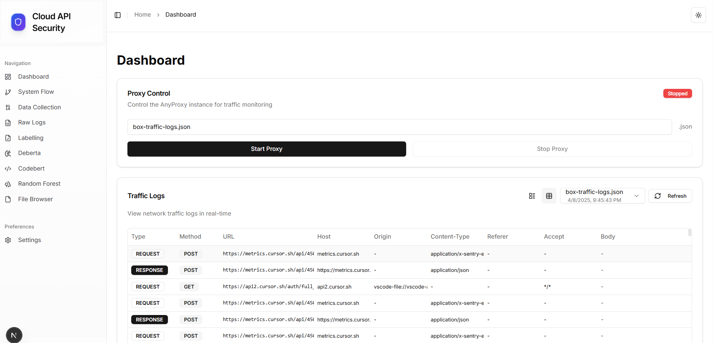
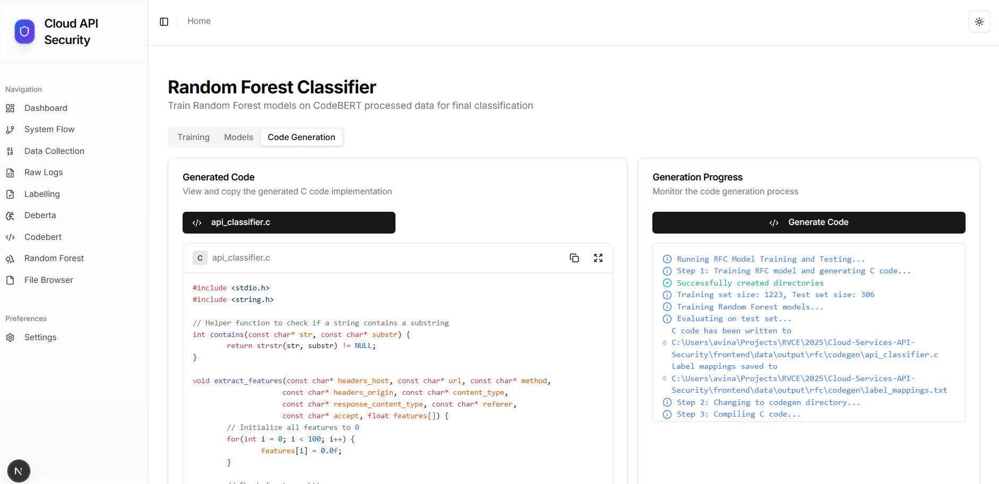

# Cloud Services API Security Analysis




## Project Structure
```
Cloud-Services-API-Security/
├── data-collection/           # Traffic capture components
│   ├── agent/                # Automated data collection
│   └── manual/              # Manual traffic capture
├── data/                    # Dataset storage
├── backend/                 # Backend API server
├── frontend/                # Next.js web application
│   ├── app/                 # Next.js App Router structure
│   ├── components/          # Reusable UI components
│   ├── public/              # Static assets
│   └── lib/                 # Utility functions and hooks
│   └── data/                # Dataset storage
├── labelling/              # Initial labeling using GPT-4/Gemini
│   ├── labelling.py       # Main labeling script
├── zsl/                    # Zero-shot learning models
│   ├── codebert/          # CodeBERT-based classifier
│   │   ├── train.py       # Training pipeline
│   │   └── inference.py   # Inference with ZSL
│   └── deberta/           # DeBERTa-based classifier
│       └── inference.py   # Multilingual ZSL inference
└── rfc/                    # Random Forest training
```

## Project Overview

1. **Data Collection**
2. **Initial Labeling** 
3. **Zero-Shot Learning**
4. **Random Forest Training and C Code Generation**: 
   - Random Forest Classifier on labeled data and C Code Generation
5. **Frontend Application**:
   - Interactive dashboard
   - Data visualization
   - Model interaction
6. **Backend Application**:
   - API server
   - Model inference
   - C code generation and model training
## Pre-requisites

1. Python 3.9 or higher
2. Node.js 22 with npm 
3. AnyProxy

<!-- ## Components

### 1. Data Collection (`/data-collection`)

#### Manual Capture
```bash
cd data-collection/manual
anyproxy --port 8001 --rule general-json-key.js
```

### 2. Initial Labeling (`/labelling`)

#### Usage
```bash
cd labelling

# Set up environment
cp .env.example .env
# Add your API keys to .env:
# OPENAI_API_KEY=your_key
# GOOGLE_API_KEY=your_key

# Install dependencies
pip install -r requirements.txt

# Run labeling
python labelling.py
```

### 3. Zero-Shot Learning (`/zsl`)

#### CodeBERT Implementation


```bash
cd zsl/codebert

# Training
python train.py 

# Inference
python inference.py 
```


#### DeBERTa Implementation

```bash
cd zsl/deberta
python inference.py 
```
### 4. Random Forest Training (`/rfc`)
#### Usage
```bash
cd rfc

# Install dependencies
pip install -r requirements.txt

# Train model
python train.py 
```

### 5. Frontend Application (`/frontend`)
Modern Next.js application with interactive UI for the entire pipeline.

#### Features
- Interactive dashboard with model visualizations
- File browser and viewer (excluding CSV files)
- Workflow animations and pipeline visualization


#### Installation
```bash
cd frontend

# Install dependencies
npm install

# Run the development server
npm run dev
```

Open [http://localhost:3000](http://localhost:3000) to see the application.

#### Key Pages
- **Dashboard**: Main metrics and visualization
- **Data Collection**: Interface for AnyProxy
- **DeBERTa/CodeBERT**: Model visualization interfaces
- **RFC Generation**: Random Forest results
- **Files**: File browser and management

### 6. Backend API Server (`/backend`)

FastAPI server with endpoints for:
- Data collection
- Initial labeling
- Zero-shot learning
- Random Forest training
- C code generation

#### Installation
```bash

python -m venv venv

# Activate the virtual environment
# On Windows:
.\venv\Scripts\activate
# On macOS/Linux:
# source venv/bin/activate

# Install dependencies
pip install -r requirements.txt

# Run the development server
uvicorn backend.main:app --reload
``` -->

## Installation

1. Clone the repository:
   ```bash
   git clone https://github.com/CubeStar1/Cloud-Services-API-Security.git
   cd Cloud-Services-API-Security
   ```

2. Set up Python virtual environment and install dependencies:
   ```bash
   # Create a virtual environment
   python -m venv venv

   # Activate the virtual environment
   # On Windows:
   .\venv\Scripts\activate
   # On macOS/Linux:
   # source venv/bin/activate

   # Install Python dependencies
   pip install -r requirements.txt
   ```

3. Set up frontend components:
   ```bash
   cd frontend
   npm install
   cd ..
   ```

4. Set up backend API server:

   From the project root directory, perform the following steps:
   ```bash
   python -m venv venv

   # Activate the virtual environment
   # On Windows:
   .\venv\Scripts\activate
   # On macOS/Linux:
   # source venv/bin/activate

   # Install dependencies
   pip install -r requirements.txt

   # Run the development server
   uvicorn backend.main:app --reload
   ```

5. Install AnyProxy:
   ```bash
   npm install -g anyproxy
   ```


6. Unzip the contents of the `backend/data/output/rfc/codegen/codegen.zip` into the `backend/data/output/rfc/codegen` directory.
> [!IMPORTANT] 
> Make sure you have the C code files unzipped into the `backend/data/output/rfc/codegen` directory. Without this, the backend will not be able to run the model inference.


## 1. Web GUI Workflow

### Starting the GUI
1. Start the frontend and backend servers:
   ```bash
   # In one terminal
   cd frontend
   npm run dev
   ```

   ```bash
   # In another terminal
   cd ..  # Go back to the root directory
   ./venv/Scripts/activate
   uvicorn backend.main:app --reload
   ```

> [!IMPORTANT]
> Make sure you have the C code file unzipped into the `backend/data/output/rfc/codegen` directory. Without this, the backend will not be able to run the model inference.
2. Access the GUI at `http://localhost:3000`

3. Run inference on a custom csv file by placing a file in `backend/data/output/rfc/test/test_set.csv` and going to `http://localhost:3000/rfc`, choosing the file from the file browser and clicking on the `Inference` tab.

### Main GUI Routes and Workflow

#### 1. `/anyproxy` - Data Collection
   - Configure and control the AnyProxy instance
   - View captured traffic in real-time
   - Raw data stored in `frontend/data/raw/`

#### 2. `/logs` - Log Processing
   - Convert raw logs to CSV format
   - Processed logs saved in `frontend/data/logs/csv/`
   - View and filter processed logs

#### 3. `/zsl/deberta` - DeBERTa Zero-Shot Learning
   - Run inference on processed logs
   - View and analyze predictions
   - Outputs to `frontend/data/output/deberta/`

#### 4. `/zsl/codebert` - CodeBERT Analysis
   - Process DeBERTa outputs
   - Refine predictions
   - Outputs to `frontend/data/output/codebert/`

#### 5. `/rfc` - Random Forest Classifier and C Code Generation
   - Train and run the RFC model
   - Ensure you have a clean, labelled output from CodeBERT in `frontend/data/output/codebert/predictions/`
   - Outputs to `frontend/data/output/rfc/`
   - C Code generated in `frontend/data/output/rfc/codegen/` for manual C code generation

#### 6. `/files` - File Management
   - Browse all generated files
   - Download or delete files
   - Navigate through output directories

### Important Notes
- The GUI and CLI use separate data directories to prevent conflicts
- To share data between CLI and GUI, manually copy files between `data/` and `frontend/data/`
- All outputs are timestamped for version control
- The GUI provides visualizations and progress tracking not available in CLI
Run both models on unlabeled traffic data:  

## 2. Command-Line Interface (CLI) Workflow

### Data Collection
1. Configure proxy rules:
   ```bash
   # Edit the proxy configuration
   nano data-collection/manual/general-json-key.js
   ```
   - Define traffic capture patterns
   - Set up any required service configurations

2. Start the proxy server:
   ```bash
   cd data-collection/manual
   anyproxy --port 8001 --rule general-json-key.js
   ```
   - Captured data is stored in `data/raw/`

### Data Processing Pipeline
1. **Convert Logs to CSV**
   ```bash
   # Process raw logs into CSV format
   cd data-collection/manual
   python csv-creation-without-tagging.py
   ```
   - Outputs structured CSV files to `data/logs/csv/`

2. **Run DeBERTa Inference (Zero-Shot Learning)**
   ```bash
   cd zsl/deberta
   python inference.py 
   ```
   - Processes CSV files from the logs
   - Outputs predictions to `data/output/deberta/`

3. **Run CodeBERT on DeBERTa Output**

   ```bash
   cd zsl/codebert
   python train.py 
   ```
   ```bash
   cd zsl/codebert
   python inference.py 
   ```
   - Takes DeBERTa predictions as input
   - Outputs refined predictions to `data/output/codebert/`

4. **Run Random Forest Classifier**
   ```bash
   cd rfc
   python train.py 
   ```
   - Processes CodeBERT outputs
   - Generates final predictions in `data/output/rfc/`


## Configuration and Workflow

### File Structure and Paths
- The project uses two main data directories:
  - Root `data/` folder: Used by command-line scripts
  - `frontend/data/` folder: Used by the web GUI
- Script paths (like in `zsl/codebert/inference.py`) point to the root `data/` directory
- Example path structure in scripts:
  ```python
  BASE_PATH = os.path.dirname(os.path.dirname(os.path.dirname(__file__)))
  PATHS = {
      'train_data': os.path.join(BASE_PATH, "data", "labelled", "train_set.xlsx"),
      'test_data': os.path.join(BASE_PATH, "data", "labelled", "test_set.xlsx"),
      'predictions_folder': os.path.join(BASE_PATH, "data", "output", "codebert", "predictions"),
  }
  ```

## Complete Workflow

1. Collect API traffic data using AnyProxy
2. Apply zero-shot learning with DeBERTa and CodeBERT
3. Train Random Forest classifier on labeled data and generate C code
4. View results and manage files through the frontend application

## Technologies Used

- **Backend**: Python, AnyProxy, FastAPI
- **Models**: DeBERTa, CodeBERT, Random Forest
- **Frontend**: Next.js, React, TypeScript, Tailwind CSS

<!-- ## C Code Generation System Explained

The Random Forest Classifier is converted into optimized C code for runtime efficiency. Here's how the system works, explained in a simple way:

### Hash Table System (Like a Library)

Imagine our system as a library with thousands of words (features). We need to find these words quickly when processing API requests. Here's how it works:

#### 1. The Library Structure
```c
typedef struct {
    int indices[10];  // Like 10 spots on each shelf
    int count;        // How many words are on this shelf
} HashBucket;

typedef struct {
    const char* term;      // The actual word
    int feature_index;     // Word's special number
} FeatureEntry;
```

#### 2. Organization System
- We have 8,192 shelves (HASH_TABLE_SIZE)
- Each shelf can hold up to 10 words
- Words are placed on shelves based on their "hash" (like a shelf number)

#### 3. Real Example
Let's say we have these API words:
```
Words to store:
- "GET"
- "POST"
- "api"
- "users"
```

The system organizes them like this:
```
Shelf 1234: ["GET", "api"]        // Two words on this shelf
Shelf 5678: ["POST"]              // One word on this shelf
... other shelves ...
```

#### 4. Finding Words
When processing an API request like "GET /api/users":

1. Split into words: ["GET", "api", "users"]
2. For each word:
   - Calculate its shelf number (hash)
   - Go directly to that shelf
   - Look through at most 10 words
   - If found, mark it in our features -->


