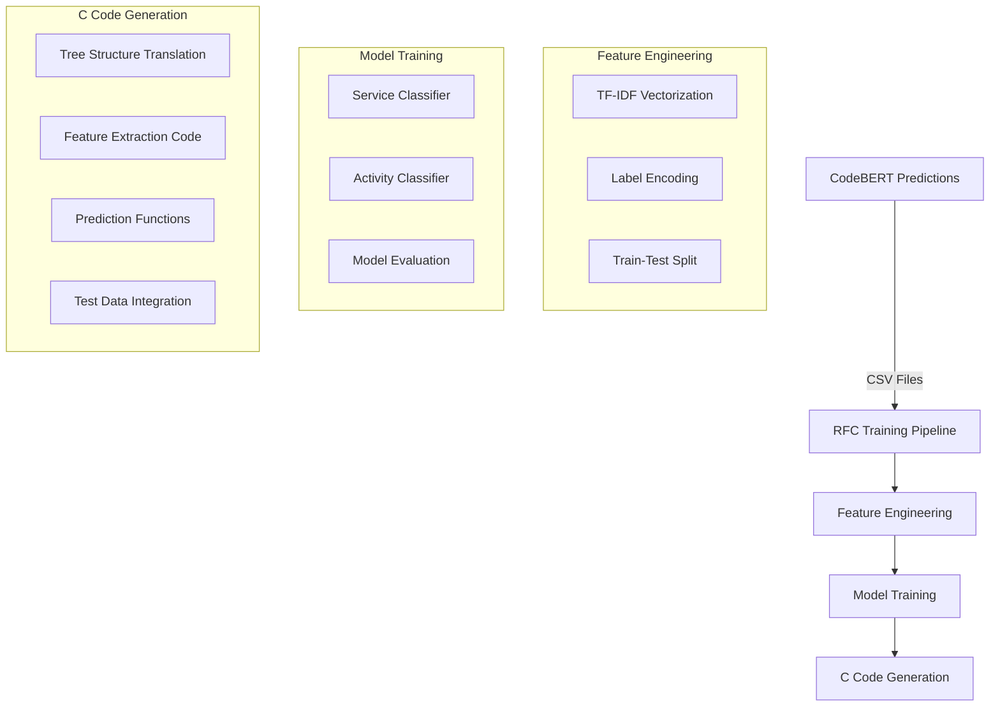
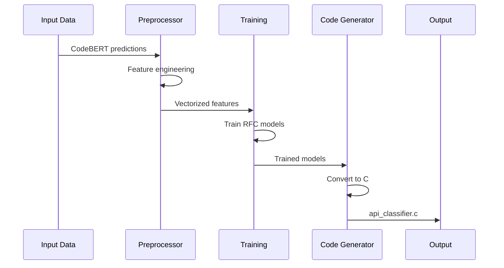

# Random Forest Classifier (RFC) C Code Generator

This plugin converts trained Random Forest models into standalone C code for API traffic classification. It's designed to work with the API Security project's pipeline, taking preprocessed data from CodeBERT predictions and generating an efficient C implementation.

## Architecture Overview



## How It Works

### 1. Data Processing Pipeline


### 2. Technical Components

#### Data Preprocessing
- Combines multiple CSV files from CodeBERT predictions
- Processes HTTP request features (URL, headers, method, etc.)
- Applies TF-IDF vectorization for text features
- Encodes service and activity labels

#### Model Training
- Uses scikit-learn's RandomForestClassifier
- Trains two separate models:
  1. Service Classifier: Identifies the cloud service
  2. Activity Classifier: Determines the API activity type
- Implements train-test split for validation
- Evaluates model performance on test data

#### C Code Generation
The `tree_to_c_code` function converts the trained models into C code through several steps:

1. **Header Generation**
   - Includes necessary C libraries
   - Defines data structures and helper functions

2. **Feature Extraction**
   ```c
   void extract_features(const char* headers_host, 
                        const char* url, 
                        const char* method,
                        // ... other parameters ...
                        float features[])
   ```
   - Converts input strings into numerical features
   - Implements TF-IDF logic in C
   - Handles string matching and feature normalization

3. **Decision Tree Implementation**
   ```mermaid
   graph TD
       A[Root Node] -->|threshold_1| B[Left Child]
       A -->|threshold_2| C[Right Child]
       B -->|threshold_3| D[Leaf: Class 1]
       B -->|threshold_4| E[Leaf: Class 2]
       C -->|threshold_5| F[Leaf: Class 3]
       C -->|threshold_6| G[Leaf: Class 4]
   ```
   - Each tree node becomes an if-else statement
   - Leaf nodes return class predictions
   - Implements voting mechanism for ensemble

4. **Prediction Functions**
   - `predict_service()`: Classifies cloud service
   - `predict_activity()`: Classifies API activity
   - Combines predictions from multiple trees

## Usage

### Running the Pipeline
1. Place the script in the project's `rfc/plugin-c` directory
2. Ensure CodeBERT predictions are in the correct input directory
3. Run using the provided batch script:
   ```bash
   run_rfc.bat
   ```

### Generated C Code Structure
```
api_classifier.c
├── Helper Functions
│   ├── contains()
│   └── extract_features()
├── Tree Functions
│   ├── service_tree_0()
│   ├── service_tree_1()
│   ├── activity_tree_0()
│   └── activity_tree_1()
├── Prediction Functions
│   ├── predict_service()
│   └── predict_activity()
└── main()
```

## Technical Details

### Feature Engineering
- Uses TF-IDF vectorization with max_features=100
- Processes 8 key HTTP request features
- Handles missing values and string normalization

### Model Configuration
```python
RandomForestClassifier(
    n_estimators=5,
    max_depth=10,
    random_state=42
)
```

### Performance Metrics
- Evaluates both Python and C implementations
- Reports accuracy for service and activity classification
- Validates C code predictions against Python model

## Files Generated
1. `api_classifier.c`: Main C implementation
2. `label_mappings.txt`: Class index to label mappings
3. Compiled binary: `api_classifier.exe`
